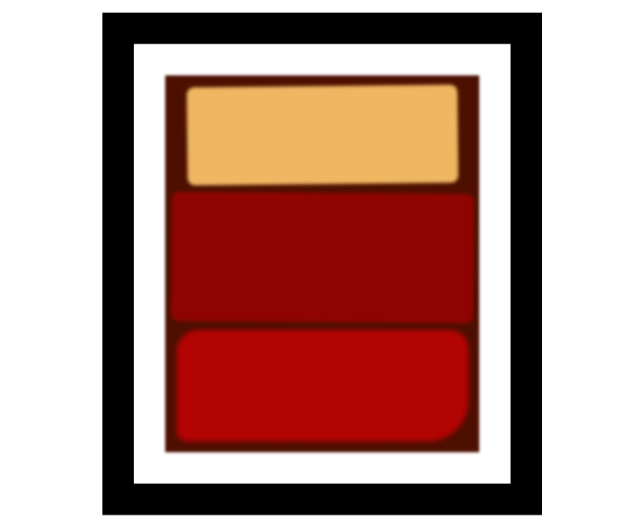

# 06-Fcc-Rothko-Painiting

> A CSS Webpage built with HTML5 and CSS



It's a project, that I used CSS and HTML5 to learn about box model, spacing, border, padding and others elements.

## Built With

- HTML5
  - `div`:used to group block-level content and structure an HTML document.
- CSS
  - `spacing`:Its adjusts the space between words in an element
  - `border`: its property is used to define the outline of an element
  - `padding`: its is used to create space around an element's content, inside any defined borders
  - `background-color`:is used to set the background color of an element.
- Linters
  - [Prettier](https://prettier.io/),
  - [Stylelint](https://stylelint.io/),
- Github Action

## Live Demo

[Live Demo Link](https://livedemo.com)

## Deployment Link

[Deployment Link](https://vercel.com/onikosi-omotayo-eniolas-projects/06-fcc-rothko-painting)

### Development (Running locally)

- Clone the project

```bash
git clone https://github.com/OMOTAYO05/html-css-template.git

```

- Install Dependencies

```bash
yarn install
```

To run StyleLint by itself, you may run the lint task:

```bash
yarn lint:check
```

Or to automatically fix issues found (where possible):

```bash
yarn lint
```

You can also check against Prettier:

```bash
yarn format:check
```

and to have it fix (to the best of its ability) any format issues, run:

```bash
yarn format
```

You can also check against HTML Validator (htmlhint):

```bash
yarn lint:html
```

To generate an accessibility report for this webpage, run the below command, it uses axe:

```bash
yarn axe
```

## Style Guides

- [CSS Style Guide](http://udacity.github.io/frontend-nanodegree-styleguide/css.html)
- [HTML Style Guide](http://udacity.github.io/frontend-nanodegree-styleguide/index.html)
- [JavaScript Style Guide](http://udacity.github.io/frontend-nanodegree-styleguide/javascript.html)
- [Git Style Guide](https://udacity.github.io/git-styleguide/)
- [AXE Accessibility Style Guide](https://dequeuniversity.com/rules/axe/html/4.7)

## 👤 Author

- Github: [@author](https://github.com/author)
- Twitter: [@author](https://twitter.com/author)
- Linkedin: [@author](https://www.linkedin.com/in/author/)

## 🤝 Contributing

Contributions, issues and feature requests are welcome!

Feel free to check the [issues page](../../issues).

## Show your support

Give a ⭐️ if you like this project!

## Acknowledgments

- Hat tip to anyone whose code was used
- Inspiration, resources/assets used
- etc

## 📝 License

[MIT licensed](./LICENSE).
